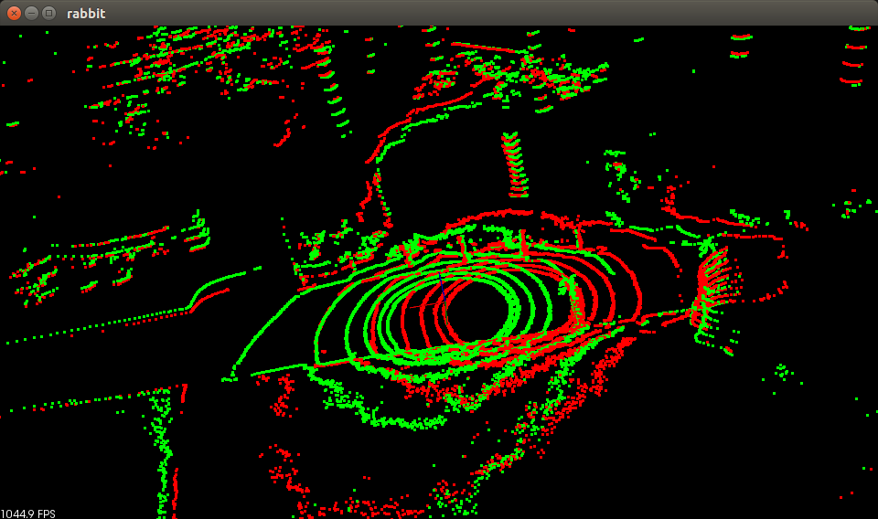
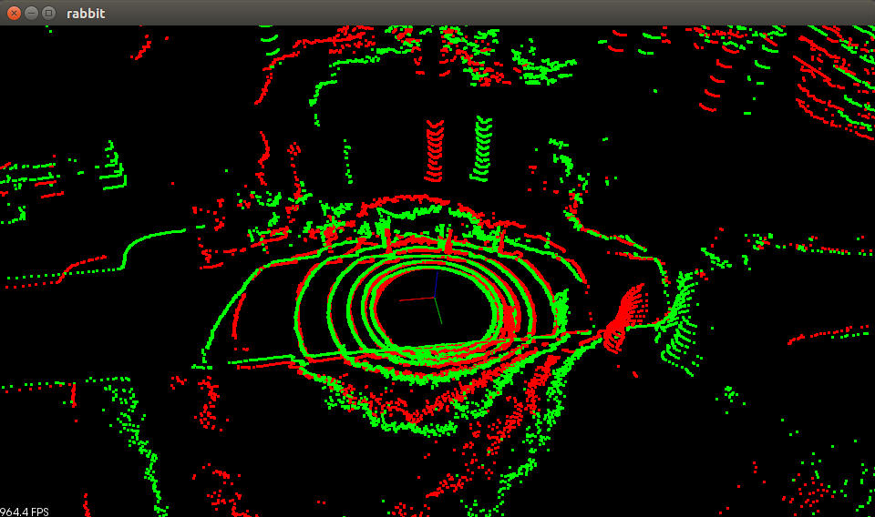
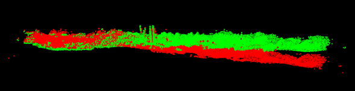
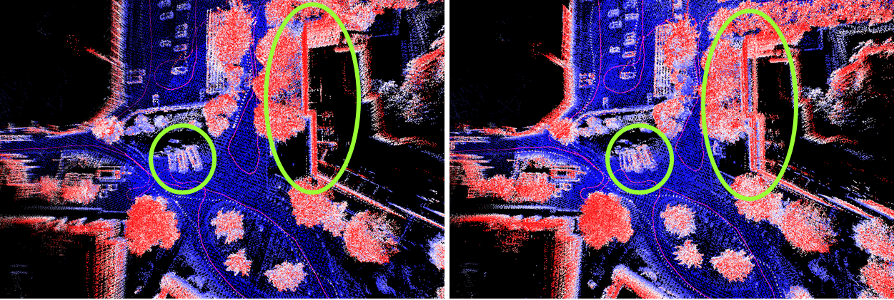
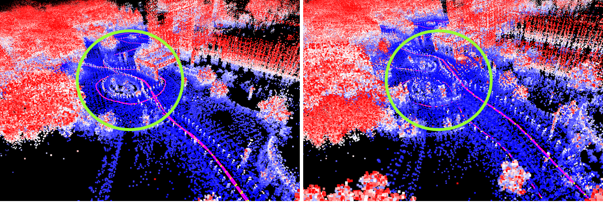
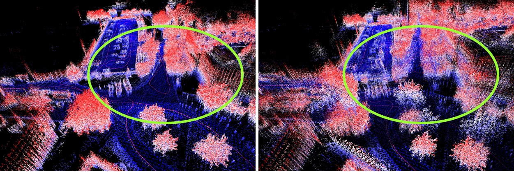

## Rabbit
> Run, rabbit, run. Dig the hole, forget the sun.


Rabbit is used to compare several odometry and registration algorithms. It also contains a complete lidar slam system, including lidar odometry, lidar mapping, graph optimization and visualization.

Download lego-loam datasets from https://drive.google.com/drive/folders/16p5UPUCZ1uK0U4XE-hJKjazTsRghEMJa. For simplicity I transfered the `.bag` data into `.pcd` files. You can also download the pcd dataset from https://drive.google.com/file/d/1aBrVegh6dhOD9TdONvlA4tEoFoUxIikd/view?usp=sharing, which is used for the demo(`RunPCD.cpp`).

### Dependency
ROS, PCL 1.8.0, Ceres, OpenCV

### Method

Rabbit supports LOAM, ICP, GICP(omp), NDT(omp) for lidar point cloud odometry and mapping. In LOAM method of rabbit, we have edge features, planar features and ground features. And the idea of ground feature is adopted from Lego-loam. Using ground prior has several advantages:
- Loam odometry can treat ground points as a unique feature to improve the accuracy and reduce mis-matching.
- We could compute a ground normal through ground points for each frame, and ground normal constraints could be introduced as a new factor in final graph optimization.
- Ground point removal is also helpful for general point cloud registration, because ground points is usually not distinguishable. Here is an example (icp registration with / without ground point removal): 





For mapping strategy, we construct a large and dense volume using three ways: submap, sliding window and moving box (similar to LOAM).  Rabbit also supports naive distance based loop closure detection and scan context loop closure detection. A graph-optimization based on Ceres is used to maintain global consistency. In current version, we optimize the keyframe constraints and ground normal constraints.

### Results


**Suitable algorithms for odometry:** Loam (feature-based, faster), GICP, ICP
**Suitable algorithms for mapping:** NDT, ICP, Loam mapping 
**Recommended combination:** Loam odometry + ndtomp mapping + naive loop closure detection + ground normal optimization,
```
rosrun rabbit RabbitRunPCD /media/wlsdzyzl/4986a128-c51f-4384-87a6-abf677343495/lidar-dataset/lego-loam/pcds loam ndtomp 2 1 1 1
```

#### Comparison
- *With/Without* ground normal optimization





- *With/Without* loop closure detection






### Next ...
- IMU factor
- Teaser++ and Ransac for global registration

### Acknowledgement
[A-LOAM](https://github.com/HKUST-Aerial-Robotics/A-LOAM), [Lego-LOAM](https://github.com/RobustFieldAutonomyLab/LeGO-LOAM)